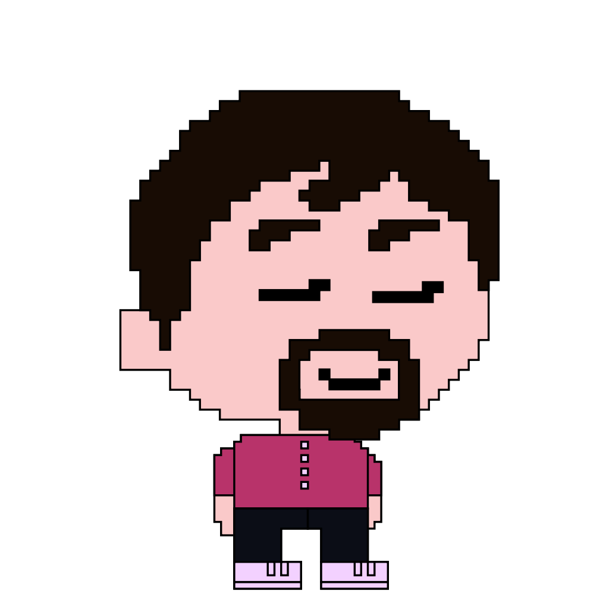

  <h1> Hi there!  My name is Noah Aldhous</h1>
  
  

    
    
      
  

  

---

### :man_technologist: I am a Fullstack Developer based in London.

- 👋 Hi, I’m @NoahAldhous
- 👀 I’m interested in ...
- 🌱 I’m currently learning ...
- 💞️ I’m looking to collaborate on ...
- 📫 How to reach me ...

<!---
NoahAldhous/NoahAldhous is a ✨ special ✨ repository because its `README.md` (this file) appears on your GitHub profile.
You can click the Preview link to take a look at your changes.
--->
